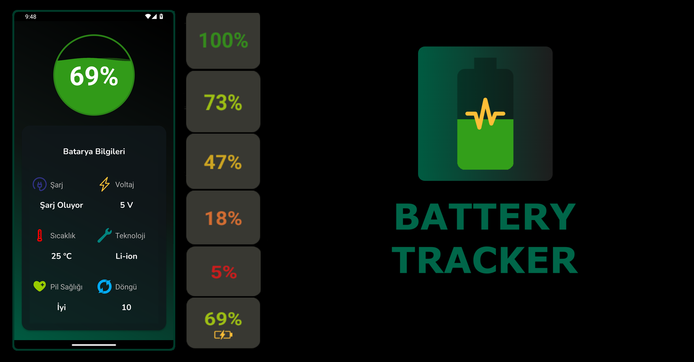

# Battery Tracker
  
 Battery Tracker is an app to check your battery status in real time. 
 In the app you can see the charge level, charging status, battery voltage, temperature, technology used, battery health and number of battery cycles <b>(If your device is android 14 - API 34)</b>. 
 With the app widget you can see the charge level and charging status. 
 ## Overview
<video controls src="assets/demo.mp4" title="App Demo"></video>
 

  <a href="app/release/batterytracker.apk">Download APK</a>

